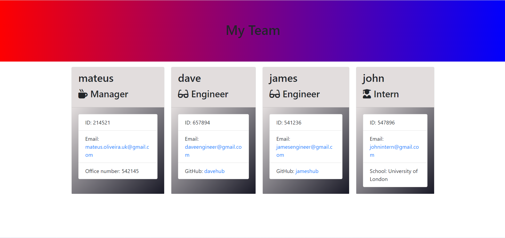

# Team Profile Generator 

  ## Table of Contents
  
  - [Description](#description)
  - [Installation](#installation)
  - [Usage](#usage)
  - [License](#license)
  - [Contributing](#contributing)
  - [Tests](#tests)
  - [Questions](#questions)

  ## Description
  
  command-line application that generates an HTML webpage with employee information. The application will take information about employees on a software engineering team, such as their name, ID, email address, and role, and use this information to generate an HTML file containing summary cards for each team member.

  ## Installation

  none

  ## Usage

  

  ## License

  This application is covered under the  license.

  ## Contributing

  

  ## Tests

  terminal

  ## Questions

  For additional questions, please contact mateus.oliveira.uk@gmail.com. Visit my [GitHub profile](https://github.com/mateusuk) to see more of my work.
  